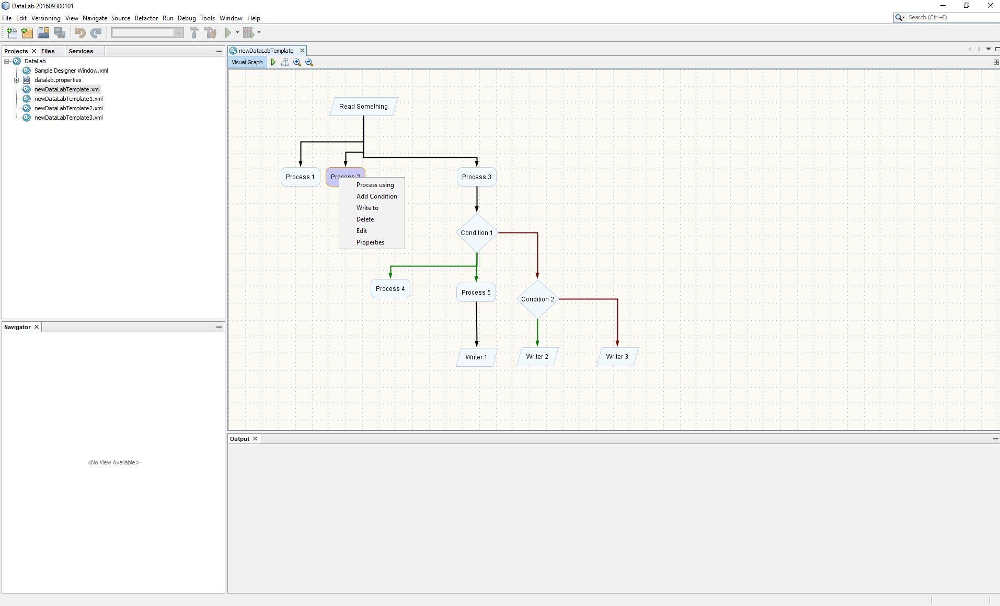
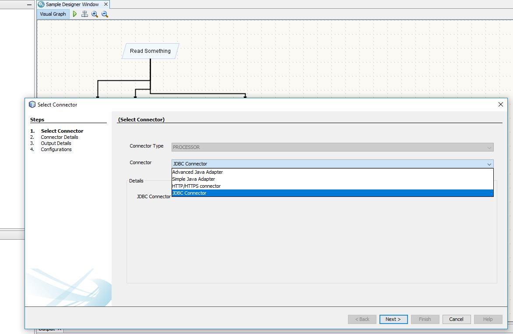
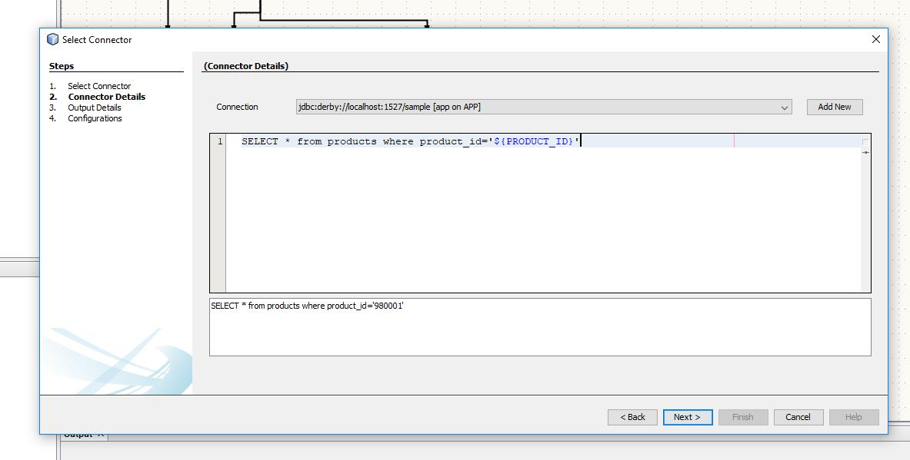
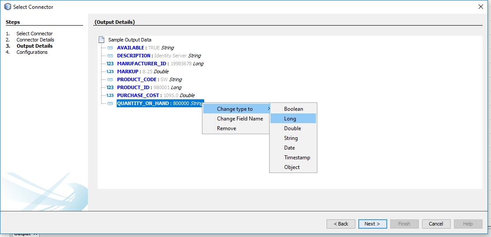
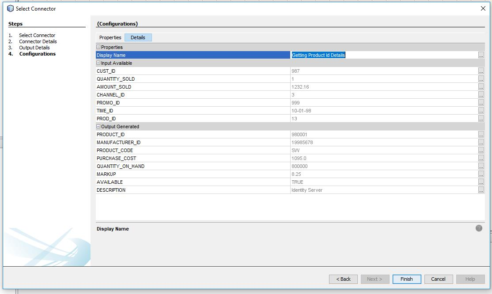
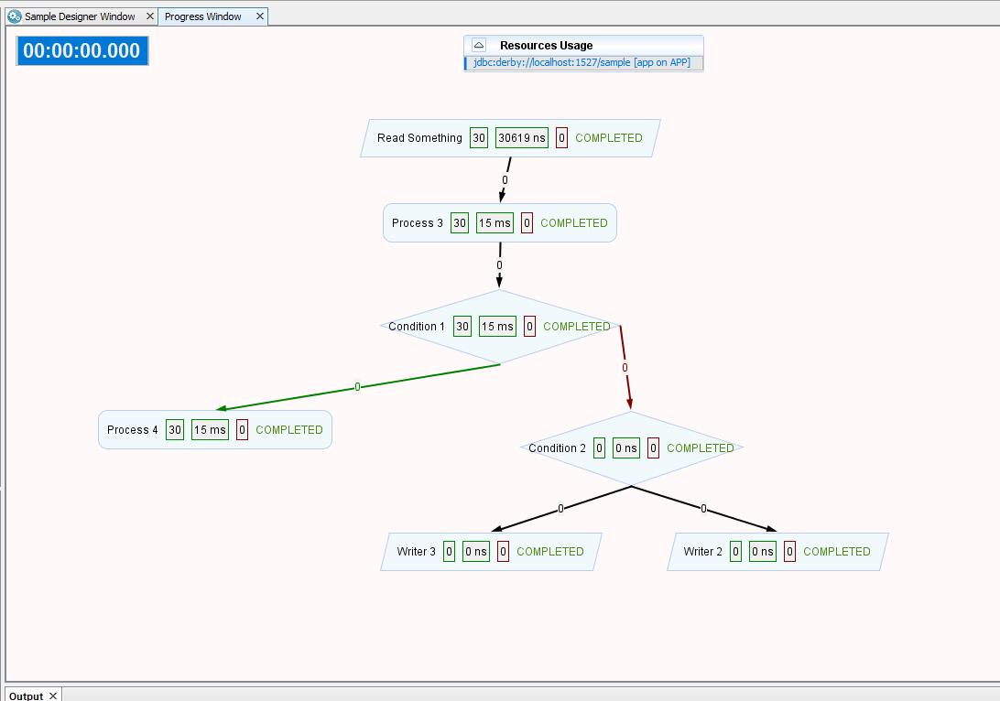

# DataLab
----------

A simplified visual solution to bridge different data systems

Design data processing tasks visually as graph by using basic constructs Reader, Processor, Writer and Condition . These tasks can be executed and execution progress would be shown visually.  

## Basic Constructs
>### Reader  
Reader generate or fetch data from a data system. Reader is the starting point for any task and only once present for any task. It does not require any input data and generate data using a data system.

>### Processor 
Processor manipulate given data by interacting with a data system. It takes input data and generate a output data.

>### Writer
Writer store/write given data into a data system. Writer takes input data and do not allow any more dataflow.

>### Condition 
Condition helps to introduce branching in data flow using given data. Data flow follows true branch if condition is evaluated to TRUE else false branch is followed.

***

## Connectors
DataLab will define connectors, which provide above basic constructs for those systems for users to interact with visually.
These connectors implement runtime logics related to those data systems and will produce or consume data as runtime execution unit by communicating with that system.

As part of DataLab version 1.0-alpha-2 following connectors are added.

| Data System                     | Reader             | Processor          | Writer             | Condition          |
|---------------------------------|:------------------:|:------------------:|:------------------:|:------------------:|
| Delimited Files (CSV, TSV ...)  | :heavy_check_mark: |                    | :heavy_check_mark: |                    |
| Excel                           | :heavy_check_mark: |                    | :heavy_check_mark: |                    |
| SQL database                    | :heavy_check_mark: | :heavy_check_mark: | :heavy_check_mark: |                    |
| Web Resources                   |                    | :heavy_check_mark: | :heavy_check_mark: |                    |
| Simplified Java Connector       |                    | :heavy_check_mark: | :heavy_check_mark: | :heavy_check_mark: |
| Advanced Java Connector         | :heavy_check_mark: | :heavy_check_mark: | :heavy_check_mark: | :heavy_check_mark: |

***

## Task Designer Window

Creating new DataLab file or opening existing one will show Task Designer window. 
> **Note**:  File :arrow_right_hook:  New File :arrow_right_hook: New DataLab File

Task Designer window enables designers to design the data processing jobs visually. Click on any node to add child, Delete, Edit and show Properties. Based on selected Node corresponding contextual actions would be shown. Designer toolbar have actions to Execute, Realign, Zoom In, Zoom Out. Execute action will open Execution window. Editing or adding a child will open Connector Wizard.

***

## Connector Wizard
Connector wizard enables designers to add new node or edit existing nodes in below four steps. Designers can validate connector for sample data (from parent node) and DataLab will handle execution logics for runtime data.

> ### Select Connector Window

This step allows designers to select connectors from available connectors for the specified type (Reader, Processor, Writer and Condition).

> ### Connector Details Window

Details required for selected connector (from step 1) shown in this window. 

As a sample, below image shows a SQL connector (Processor) . SQL connector display available SQL resources as drop down, query editor and substituted query. Designers can add new SQL DB connections from this wizard; clicking Add new would register
new DB connections. On Clicking Next, validation on the given data is performed if validation failed errors would be notified.

> ### Output Details Window

>> **Note**: Not shown for Writer and Condition since they do not produce data.

From validation done in previous Connector Details Window, sample generated output data’s are shown in this window. Designers have options to convert values into various standard types (Boolean, Long, Double, String, Date, Timestamp, Object). If Designer trying to edit existing node, this window will validate whether existing output data and newly generated output data are of same name and type for compatibility.

> ### Configurations Window

This step enables designers to view or edit properties of this node (THREAD_COUNT, NAME …).
On completing this step, the newly created node would be added to Task Graph, with a new Edge from corresponding parent node. 

***

## Execution Window
On Clicking Execute in Task Designer Window, Execution for the given task will be shown visually.

***